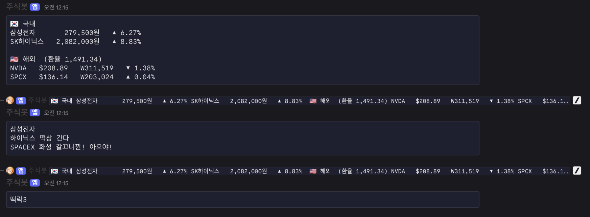

# MyDiscordStockBot

Discord에서 `/주식` 명령으로 등록한 국내·해외 종목의 실시간 시세를 조회해주는 Kotlin으로 만든 봇입니다.

- 명령을 입력하면 시세 표(현재가·등락률)와 환율을 보여주고,
- 종목별로 설정한 **상승/하락 특수 메시지**를 이어서 전송합니다.

## 작동 예시



## 주요 기능

- **`/주식` 슬래시 커맨드** — 등록된 모든 종목의 현재가·전일대비 등락률을 표로 응답
- **국내(KR)·미국(US) 지원** — 한국거래소 6자리 코드, 나스닥/NYSE 티커
- **실시간 환율(USD→KRW)** 자동 반영
- **종목별 상승/하락 메시지** — `upMessage`(상승 시), `downMessage`(하락 시) 특수 메세지를 Discord 코드블록으로 전송합니다.
- **설정 파일 기반** — 종목 추가/삭제는 `stocks.yaml`만 수정하고 봇 재시작
- 시세는 [Yahoo Finance](https://finance.yahoo.com) API로 조회

## 요구 사항

- JDK 21 이상이
- Discord 봇 토큰 및 봇이 초대된 서버

> ⚠️ 봇 초대 시 OAuth2 스코프에 **`bot`** 과 **`applications.commands`** 를 모두 포함해야 슬래시 커맨드가 등록됩니다.

## 설정

1. `.env.example` 을 복사해 `.env` 를 만들고 값을 채웁니다.

   ```bash
   cp .env.example .env
   ```

   | 환경변수 | 설명 | 필수 |
   |----------|------|------|
   | `DISCORD_TOKEN` | Discord 봇 토큰 (Developer Portal → Bot → Reset Token) | ✅ |
   | `STOCKS_FILE` | 종목 설정 파일 경로 (기본 `stocks.yaml`) | ✅ |

2. `stocks.yaml` 에 조회할 종목을 등록합니다.

   ```yaml
   # market: KR (한국거래소, 6자리 코드) | US (나스닥/NYSE, 티커)
   # upMessage/downMessage: 상승/하락 시 표 아래에 별도 코드블록으로 보낼 문구 (선택)
   stocks:
     - ticker: "005930"
       name: "삼성전자"
       market: KR
       upMessage: "삼성전자 가즈아!"
       downMessage: "떨어졌어요..."

     - ticker: "NVDA"
       name: "엔비디아"
       market: US
   ```

## 실행

```bash
./gradlew run
```

`run` 태스크는 프로젝트 루트의 `.env` 를 읽어 환경변수로 주입합니다. 봇이 실행되면 `/주식` 명령을 봇이 속한 모든 서버에 등록하고 대기합니다.

### 배포용 실행 파일

```bash
./gradlew fatJar
java -jar build/libs/stockbot.jar
```

## 프로젝트 구조

```
src/main/kotlin/bot/
├── Main.kt                     # 진입점: 설정 로드, JDA 기동, /주식 명령 등록
├── model/Models.kt             # StockConfig, Quote, MarketSnapshot 등 도메인 모델
├── quote/YahooQuoteProvider.kt # Yahoo Finance 시세·환율 조회
└── discord/
    ├── StockBot.kt             # /주식 슬래시 커맨드 리스너
    └── MessageFormatter.kt     # 시세 표·특수 메시지 포맷팅
stocks.yaml                     # 종목 설정 (재빌드 없이 수정 가능)
```

## 기술 스택

- Kotlin 2.0 / JVM 21
- [JDA](https://github.com/discord-jda/JDA) — Discord API
- [Ktor Client](https://ktor.io) — 시세 API 호출
- [kaml](https://github.com/charleskorn/kaml) — YAML 파싱
- kotlinx.coroutines / kotlinx.serialization

## 참고

- Yahoo Finance는 비공식 엔드포인트라 서비스 사정에 따라 응답이 바뀌거나 중단될 수 있습니다.
- 국내 종목은 야후 조회 시 `.KS`(코스피) → `.KQ`(코스닥) 순으로 자동 시도합니다.
